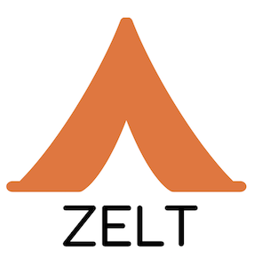

Zalando end-to-end load tester
******************************

.. image:: https://travis-ci.org/zalando-incubator/zelt.svg?branch=master
   :alt: travis-ci status badge
   :target: https://travis-ci.org/zalando-incubator/zelt

.. image:: https://badgen.net/pypi/v/zelt
   :alt: pypi version badge
   :target: https://pypi.org/project/zelt

.. image:: https://api.codacy.com/project/badge/Grade/a74dee2bbbd64da8951a3cec5059dda3
   :alt: code quality badge
   :target: https://www.codacy.com/app/bmaher/zelt

.. image:: https://api.codacy.com/project/badge/Coverage/a74dee2bbbd64da8951a3cec5059dda3
   :alt: test coverage badge
   :target: https://www.codacy.com/app/bmaher/zelt

.. image:: https://badgen.net/badge/code%20style/black/000
   :alt: Code style: Black
   :target: https://github.com/ambv/black

A **command-line tool** for orchestrating the deployment of
Locust_ in Kubernetes_.

Use it in conjunction with Transformer_ to run large-scale end-to-end
load testing of your website.

Prerequistes
============

-  `Python 3.6+`_

Installation
============

Install using pip:

.. code:: bash

   pip install zelt

Usage
=====

Example HAR files, locustfile, and manifests are included in the
``examples/`` directory, try them out.

**N.B** The cluster to deploy to is determined by your currently
configured context. Ensure you are `using the correct cluster`_
before using Zelt.

Locustfile as input
-------------------

Zelt can deploy Locust with a locustfile to a cluster:

.. code:: bash

   zelt from-locustfile PATH_TO_LOCUSTFILE --manifests PATH_TO_MANIFESTS

HAR files(s) as input
---------------------

Zelt can transform HAR file(s) into a locustfile and deploy it along
with Locust to a cluster:

.. code:: bash

   zelt from-har PATH_TO_HAR_FILES --manifests PATH_TO_MANIFESTS

**N.B** This requires
Transformer_ to be installed. For more information about Transformer,
please refer to `Transformer's documentation`_.

Rescale a deployment
--------------------

Zelt can rescale the number of workers_ in a deployment it has made
to a cluster:

.. code:: bash

   zelt rescale NUMBER_OF_WORKERS --manifests PATH_TO_MANIFESTS

Delete a deployment
-------------------

Zelt can delete deployments it has made from a cluster:

.. code:: bash

   zelt delete --manifests PATH_TO_MANIFESTS

Run Locust locally
------------------

Zelt can also run Locust locally by providing the ``--local/-l`` flag to
either the ``from-har`` or ``from-locustfile`` command e.g.:

.. code:: bash

   zelt from-locustfile PATH_TO_LOCUSTFILE --local

Use S3 for locustfile storage
-----------------------------

By default, Zelt uses a ConfigMap for storing the locustfile. ConfigMaps
have a file-size limitation of ~2MB. If your locustfile is larger than
this then you can use an S3 bucket for locustfile storage.

To do so, add the following parameters to your Zelt command:

-  ``--storage s3``: Switch to S3 storage
-  ``--s3-bucket``: The name of your S3 bucket
-  ``--s3-key``: The name of the file as stored in S3

**N.B.** Zelt will *not* create the S3 bucket for you.

**N.B.** Make sure to update your deployment manifest(s) to download the
locustfile file from S3 instead of loading from the ConfigMap volume
mount.

Use a configuration file for Zelt options
-----------------------------------------

An alternative to specifying Zelt’s options on the command-line is to
use a configuration file, for example:

.. code:: bash

   zelt from-har --config examples/config/config.yaml

**N.B.** The configuration file’s keys are the same as the command-line
option names but without the double dash (``--``).

Documentation
=============

Take a look at our documentation_ for more details.

Contributing
============

Please read `CONTRIBUTING.md <CONTRIBUTING.md>`__ for details on our
process for submitting pull requests to us, and please ensure you follow
the `CODE_OF_CONDUCT.md <CODE_OF_CONDUCT.md>`__.

Versioning
==========

We use SemVer_ for versioning.

Authors
=======

-  **Brian Maher** - `@bmaher`_
-  **Oliwia Zaremba** - `@tortila`_
-  **Thibaut Le Page** - `@thilp`_

See also the list of `contributors <CONTRIBUTORS.md>`__ who participated
in this project.

License
=======

This project is licensed under the MIT License - see the
`LICENSE <LICENSE>`__ file for details

.. _Locust: https://locust.io/
.. _Kubernetes: https://kubernetes.io/
.. _Transformer: https://github.com/zalando-incubator/transformer
.. _`Python 3.6+`: https://www.python.org/downloads/
.. _`using the correct cluster`: https://kubernetes.io/docs/reference/kubectl/cheatsheet/#kubectl-context-and-configuration
.. _`Transformer's documentation`: https://transformer.readthedocs.io/
.. _workers: https://docs.locust.io/en/stable/running-locust-distributed.html
.. _documentation: https://zelt.readthedocs.io/
.. _`@bmaher`: https://github.com/bmaher
.. _`@tortila`: https://github.com/tortila
.. _`@thilp`: https://github.com/thilp
.. _SemVer: http://semver.org/
